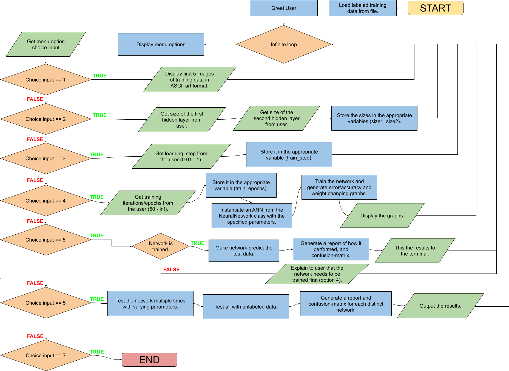
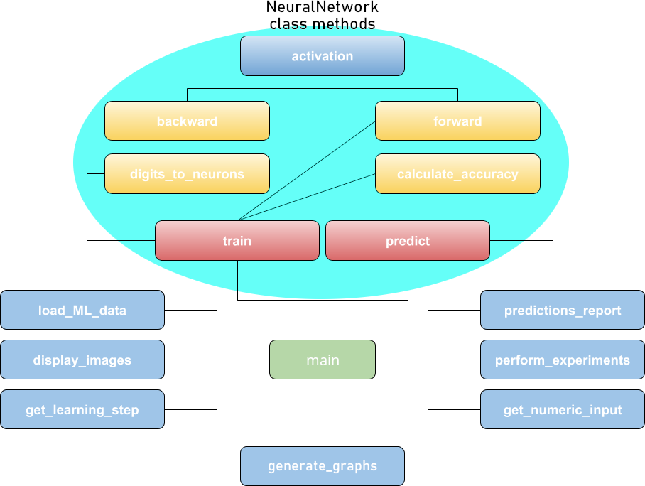
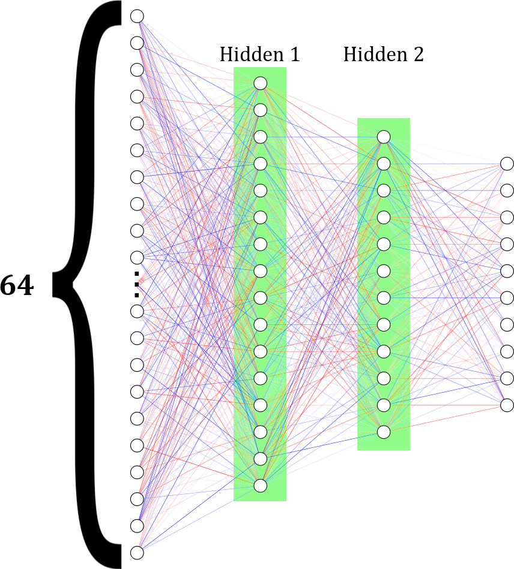

# Python - Artificial Neural Network from Scratch

This project utilizes the python programming language to implement an Artificial Neural Network (ANN) from scratch which recognizes handwritten digits on 8*8px images from the [Optical Handwritten Digits Recognition Dataset](https://archive.ics.uci.edu/dataset/80/optical+recognition+of+handwritten+digits "Dataset").

* * *

# Important Details

Please take the time to read this guide thoroughly to ensure a smooth execution of the program.

## Structure

The entire program is organized into two *modules*, each serving a specific purpose.
The overall structure of the program can be seen as follows:

- `main.py` : Contains the user-interface for the program.

- `machine_learning.py` : Contains functionality code for the program.

## Execution Environment & Software Versions

⚠️ Ensure that you have Python version 3.11 or higher installed on your system, <u>otherwise the code will not execute properly</u>. ⚠️

## External Packages (pip)

These are the required external-packages:

+ `seaborn`
	- `matplotlib`
+ `pandas`
	- `numpy`
+ `scikit-learn`

You need only install 3 packages instead of all of them explicitly, since some of them are dependencies.

`python -m pip install --upgrade seaborn pandas scikit-learn`

## Directory Structure

All of the program's source-files are stored in the `src` subdirectory.

The data-files which are analyzed and processed by the program, are stored in a separate subdirectory named `Assets`.
(The program will read these files in that location)

The `Assets` folder includes the following files:

1. `training_data.dat` : The training data required to train the Artifical Neural Network (ANN).

2. `testing_data.dat` : The testing data for testing the ANN's performance.

* * *

# Worth Noting

## ANSI code

The code makes use of [ANSI escape-codes](https://gist.github.com/fnky/458719343aabd01cfb17a3a4f7296797) to enhance the visual appearance in the Command Line Interface (CLI). These codes enable color and text formatting (bold, underline, italics),
resulting in a better user experience. However, for them to apply the terminal-emulator being used needs to support them.

## Pre-Trained Network

Inside the project's folder, there is a file named `Trained_Network.npz`. This file contains the sizes, weights, and biases of a pre-trained network with an average accuracy of 93% on testing data.

If you wish to test this pre-trained network, simply move the file to the `Assets` directory. When you run the program select option 5, the pre-trained network will be automatically imported.

It is also possible to continue training the network through option 4. However, please note that at this stage, the network might get overtrained.

# Visualization

## Flowchart

## Function Interdependency

## ANN Structure

